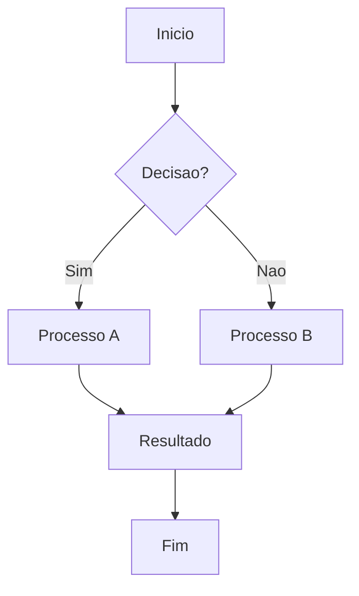
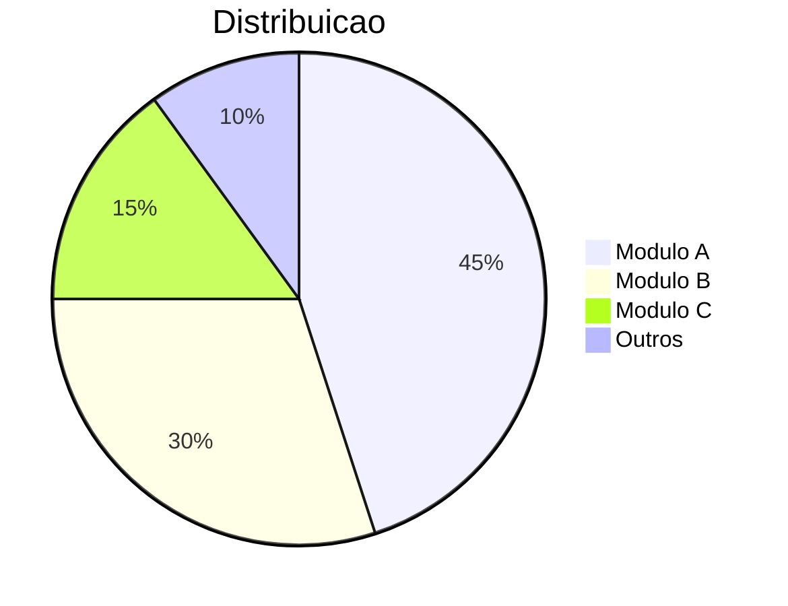
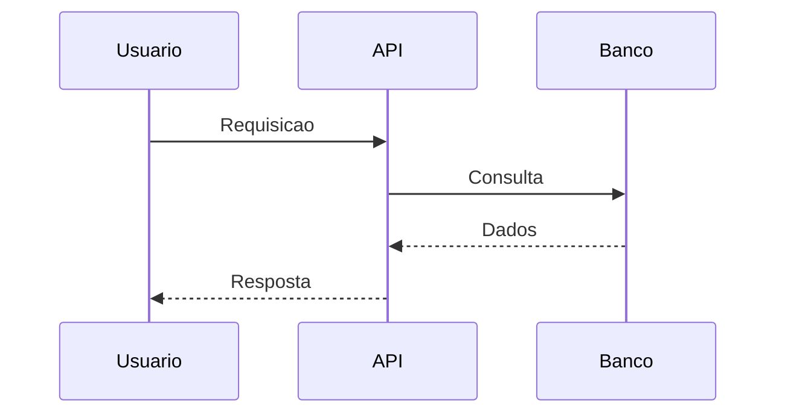

# github-markdown

## 📊 Vis Geral



## 🚀 Funcionalidades

- Funcionalidade 1
- Funcionalidade 2
- Funcionalidade 3

## 📈 Metricas



## 🔄 Fluxo



## 🛠 Tecnologias

- PHP / Laravel
- MySQL / PostgreSQL
- AWS / Docker

## 📋 Instalacao

```bash
git clone https://github.com/usuario/gituhub-markdown.git
cd projeto
composer install
```

## 📞 Contato

- Email: seu-email@exemplo.com

---

*Desenvolvido por **Mauro Willian** 🇧🇷*
